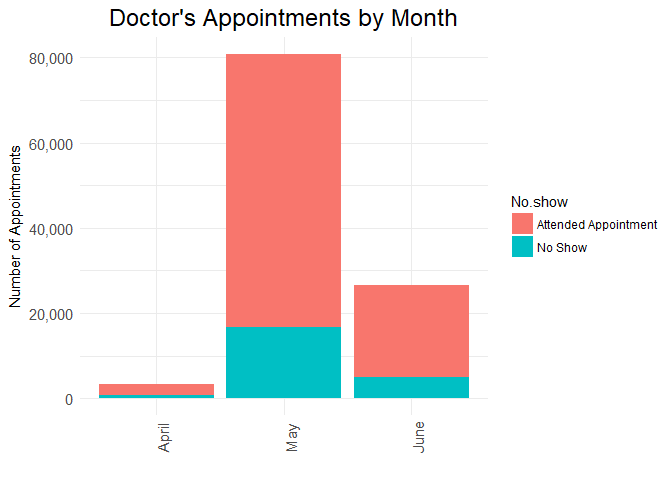
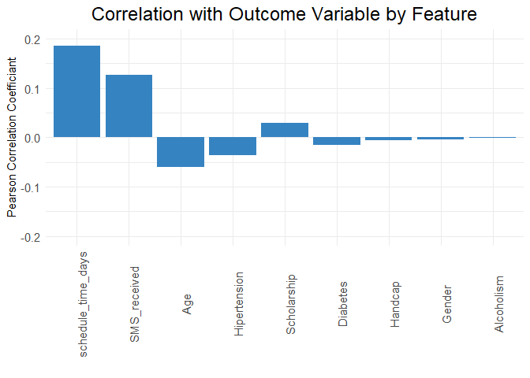
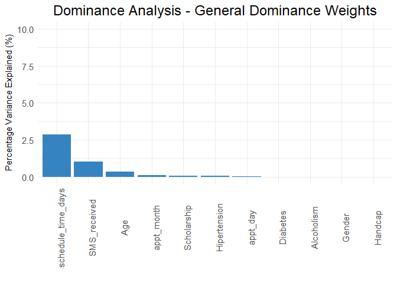
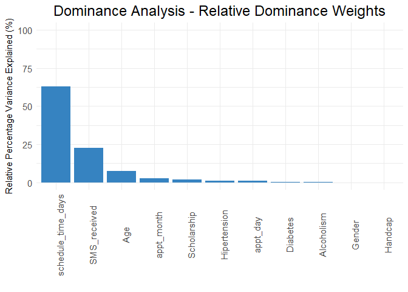

In this project I apply ANOVA and Dominance Analysis to investigate the
causes of why patients skip their scheduled doctor's appointments.

The data set comes from Kaggle
(<https://www.kaggle.com/joniarroba/noshowappointments>) and includes
demographic and contextual data for over 62,000 patients from Vitoria,
Brazil.

    library(dplyr)
    library(tidyr)
    library(ggplot2)
    library(yhat)
    library(ggthemes)
    library(Cairo)
    library(scales)

    options(repr.plot.width=5, repr.plot.height=4)
    options(scipen = 99)

    # Import the data
    appt <- read.csv("KaggleV2-May-2016.csv", header=T, stringsAsFactors = F) 
    # Convert gender and outcome variable to numeric
    appt$Gender <- as.numeric(as.factor(appt$Gender)) - 1
    appt[appt$No.show=="No", "No.show"] <- 0
    appt[appt$No.show=="Yes", "No.show"] <- 1
    appt$No.show <- as.numeric(appt$No.show)
    # Extract the length of time in days between the patient scheduling the appointment and the appointment date
    appt$schedule_time_days <- as.numeric(as.Date(appt$AppointmentDay) - as.Date(appt$ScheduledDay))
    # Extract the day of the week from the appointment date timestamp
    appt$appt_day <- factor(weekdays(as.Date(appt$AppointmentDay)))
    # Extract month from the appointment date timestamp
    appt$appt_month <- factor(months(as.Date(appt$AppointmentDay)))
    # Convert neighborhood to factor
    appt$Neighbourhood <- factor(appt$Neighbourhood)
    # Select relevant columns for ANOVA and dominance analysis 
    appt <- appt %>%
      select(14, 3, 6, 8:13, 15:17, 7)

    head(appt)

    ##   No.show Gender Age Scholarship Hipertension Diabetes Alcoholism Handcap
    ## 1       0      0  62           0            1        0          0       0
    ## 2       0      1  56           0            0        0          0       0
    ## 3       0      0  62           0            0        0          0       0
    ## 4       0      0   8           0            0        0          0       0
    ## 5       0      0  56           0            1        1          0       0
    ## 6       0      0  76           0            1        0          0       0
    ##   SMS_received schedule_time_days appt_day appt_month     Neighbourhood
    ## 1            0                  0   Friday      April   JARDIM DA PENHA
    ## 2            0                  0   Friday      April   JARDIM DA PENHA
    ## 3            0                  0   Friday      April     MATA DA PRAIA
    ## 4            0                  0   Friday      April PONTAL DE CAMBURI
    ## 5            0                  0   Friday      April   JARDIM DA PENHA
    ## 6            0                  2   Friday      April        REPÃ<U+009A>BLICA

The outcome variable ('No.show') we're trying to investigate is whether
or not a patient skipped their scheduled doctor's appointment. The data
contains a variety of variables for each patient including age, medical
conditions, appointment and scheduling dates, and neighborhood.

In order to determine if there are meaningful differences in the no-show
percentages across the categorical variables in our data set we'll apply
the Analysis of Variance (ANOVA) method. ANOVA is a method for comparing
sample means across two or more groups, and determine if there is a
statistically signficant difference in these means. By leveraging ANOVA
with our data set we'll be able to determine if the day of the week, the
month, or a patient's neighborhood has a meaningful impact on our
outcome variable.

    # ANOVA for day of week
    appt_day <- appt %>%
      select(appt_day, No.show)
    av_day <- aov(No.show ~ appt_day, data=appt_day)
    summary(av_day)

    ##                 Df Sum Sq Mean Sq F value    Pr(>F)    
    ## appt_day         5      4  0.8853   5.495 0.0000462 ***
    ## Residuals   110521  17808  0.1611                      
    ## ---
    ## Signif. codes:  0 '***' 0.001 '**' 0.01 '*' 0.05 '.' 0.1 ' ' 1

The ANOVA analysis by day of week yielded an F value of 5.5 with a
p-value less than .001, this means we can be 99.9% sure that the day of
the week has an impact on the no-show percentages of the patients.

    # Visualize difference in no show averages across days of the week
    appt_day$appt_day <- factor(appt_day$appt_day, levels = c("Monday", "Tuesday", "Wednesday", "Thursday", "Friday", "Saturday"))
    appt_day$No.show <- as.character(appt_day$No.show)
    appt_day[appt_day$No.show==1, "No.show"] <- "No Show"
    appt_day[appt_day$No.show==0, "No.show"] <- "Attended Appointment"
    ggplot(appt_day, aes(x=appt_day)) + 
      geom_bar(aes(fill=No.show)) +
      ggtitle("Doctor's Appointments by Day of Week") +
      labs(x="", y="Number of Appointments") +
      theme_minimal() +
      scale_colour_tableau() +
      scale_y_continuous(labels = comma) +
      theme(plot.title = element_text(size=18, hjust=.5),
            axis.title = element_text(size=11),
            axis.text = element_text(size=11),
            axis.text.x = element_text(angle = 90)) 

    # ANOVA for month of appointment
    appt_month <- appt %>%
      select(appt_month, No.show)
    av_month <- aov(No.show ~ appt_month, data=appt_month)
    summary(av_month)

    ##                 Df Sum Sq Mean Sq F value              Pr(>F)    
    ## appt_month       2     11   5.474   33.99 0.00000000000000176 ***
    ## Residuals   110524  17801   0.161                                
    ## ---
    ## Signif. codes:  0 '***' 0.001 '**' 0.01 '*' 0.05 '.' 0.1 ' ' 1

The ANOVA analysis by month of the appointment also yielded a very low
p-value less than .001. When conducting ANOVA, the null hypothesis is
that the group means across our categorical variable are equal. The low
p-value indicates that we can reject the null hypothesis with 99.9%
confidence.

    # Visualize difference in no show averages across months of the year
    appt_month$No.show <- as.character(appt_month$No.show)
    appt_month$appt_month <- factor(appt_month$appt_month, levels=c("April", "May", "June"))
    appt_month[appt_month$No.show==1, "No.show"] <- "No Show"
    appt_month[appt_month$No.show==0, "No.show"] <- "Attended Appointment"
    ggplot(appt_month, aes(x=appt_month)) + 
      geom_bar(aes(fill=No.show)) +
      ggtitle("Doctor's Appointments by Month") +
      labs(x="", y="Number of Appointments") +
      theme_minimal() +
      scale_colour_tableau() +
      scale_y_continuous(labels = comma) +
      theme(plot.title = element_text(size=18, hjust=.5),
            axis.title = element_text(size=11),
            axis.text = element_text(size=11),
            axis.text.x = element_text(angle = 90)) 

    # ANOVA for neighborhood
    appt_nbhd <- appt %>%
      select(Neighbourhood, No.show)
    av_nbhd <- aov(No.show ~ Neighbourhood, data=appt_nbhd)
    summary(av_nbhd)

    ##                   Df Sum Sq Mean Sq F value              Pr(>F)    
    ## Neighbourhood     80     79  0.9910   6.172 <0.0000000000000002 ***
    ## Residuals     110446  17733  0.1606                                
    ## ---
    ## Signif. codes:  0 '***' 0.001 '**' 0.01 '*' 0.05 '.' 0.1 ' ' 1

The p-value derived from the ANOVA analysis by neighborhood was also
less than .001, meaning that we can be 99.9% confident that a patient's
neighborhood has an effect on their rate of skipping doctor's
appointments.

    # Visualize difference in no show averages across neighborhoods
    appt_nbhd_sum <- appt_nbhd %>%
      group_by(Neighbourhood) %>%
      summarize(pct_no_shows = mean(No.show, na.rm=T)*100) %>%
      arrange(desc(pct_no_shows))
    appt_nbhd_sum$Neighbourhood <- factor(as.character(appt_nbhd_sum$Neighbourhood), levels = c(as.character(appt_nbhd_sum$Neighbourhood)))
    ggplot(appt_nbhd_sum, aes(x=Neighbourhood, y=pct_no_shows)) + 
      geom_bar(stat="identity",  fill="#3683c1") +
      ggtitle("Doctor's Appointments by Neighborhood") +
      labs(x="", y="Percentage of No Shows") +
      theme_minimal() +
      scale_y_continuous(labels = comma) +
      theme(plot.title = element_text(size=18, hjust=.5),
            axis.title = element_text(size=11),
            axis.text.x=element_blank())

In order to measure the extent to which the other features in our data
set relate to the outcome variable we can apply the Pearson correlation.
Pearson's Product Moment correlation coefficiant examines the extent to
which two continuous variables relate to each other on a -1 to 1 scale
(-1 representing a perfect negative linear relationship and 1
corresponding to a perfect postive linear relationship).

    # Get pearson correlation between continous predictor variables and no show status
    temp <- appt %>%
      select(Gender, Age, Scholarship, Hipertension, Diabetes, Alcoholism, Handcap, SMS_received, schedule_time_days)
    temp_cor <- data.frame(apply(temp, 2, function(x) cor.test(x, appt$No.show, method='p')$estimate))
    colnames(temp_cor) <- "pearson_correlation_coeff"
    temp_cor <- temp_cor %>%
      mutate(feature = rownames(temp_cor)) %>%
      select(2,1) %>%
      arrange(desc(abs(pearson_correlation_coeff)))
    temp_cor$feature <- factor(temp_cor$feature, levels = temp_cor$feature)
    ggplot(temp_cor, aes(x=feature, y=pearson_correlation_coeff)) + 
      geom_bar(stat="identity", fill="#3683c1") +
      ggtitle("Correlation with Outcome Variable by Feature") +
      labs(x="", y="Pearson Correlation Coefficiant") +
      theme_minimal() +
      scale_y_continuous(labels = comma) +
      expand_limits(y = c(-.2, .2)) +
      guides(fill=FALSE) +
      theme(plot.title = element_text(size=18, hjust=.5),
            axis.title = element_text(size=11),
            axis.text = element_text(size=11),
            axis.text.x = element_text(angle = 90)) 

Dominance Analysis is a lesser known statistical method that examines
the extent to which the variance in the outcome variable can be
attributed to each of the predictor variables (features). Dominance
Analysis goes beyond examining correlations between each of the features
by statistically controlling for confounding influences between
features. In this method, a multivariate regression model is generated
across all possible subsets of the features. The residuals of these
models are compared to generate dominance weights, which represent the
percentage of variance in the outcome variable that can be directly
attributed to each of the features in the feature space.

    # Perform dominance analysis
    # Conduct all possible subsets regression on the NPS data 
    aps <- aps(appt, dv = "No.show", ivlist = c("Gender", "Age", "Scholarship", "Hipertension", "Diabetes", "Alcoholism", "Handcap", "SMS_received", "schedule_time_days", "appt_day", "appt_month"))
    # With the output from all possible subsets regression, conduct dominance analysis
    da <- dominance(aps)
    total_variance_pred <- sum(da$GD)
    da_results <- data.frame(da$GD)
    da_results$feature <- row.names(da_results)
    colnames(da_results) <- c("general_dominance_weights", "feature")
    da_results <- da_results %>%
       select(2,1) %>%
       mutate(da_results_relative = general_dominance_weights / sum(general_dominance_weights, na.rm=T)) %>%
       arrange(desc(da_results_relative))

    print(da_results)

    ##               feature general_dominance_weights da_results_relative
    ## 1  schedule_time_days             0.02848898600        0.6287648986
    ## 2        SMS_received             0.01020826475        0.2253010532
    ## 3                 Age             0.00341238260        0.0753128384
    ## 4          appt_month             0.00114864800        0.0253511846
    ## 5         Scholarship             0.00080614482        0.0177919833
    ## 6        Hipertension             0.00058074618        0.0128173327
    ## 7            appt_day             0.00043912570        0.0096917042
    ## 8            Diabetes             0.00010559092        0.0023304398
    ## 9          Alcoholism             0.00008570779        0.0018916099
    ## 10             Gender             0.00002075596        0.0004580936
    ## 11            Handcap             0.00001308816        0.0002888618

As we can see only a small percentage of the variance in the patient no
show rate can be attributed to the variables in our data set.

    da_results[,c(2,3)] <- da_results[,c(2,3)]*100
    da_results$feature <- factor(da_results$feature, levels = c(da_results$feature))

    ggplot(da_results, aes(x=feature, y=general_dominance_weights)) + 
      geom_bar(stat="identity", fill="#3683c1") +
      expand_limits(y = 10) +
      ggtitle("Dominance Analysis - General Dominance Weights") +
      labs(x="", y="Percentage Variance Explained (%)") +
      theme_minimal() +
      scale_y_continuous(labels = comma) +
      theme(plot.title = element_text(size=18, hjust=.5),
            axis.title = element_text(size=11),
            axis.text = element_text(size=11),
            axis.text.x = element_text(angle = 90)) 

By converting the general dominance weights to relative percentages, we
can examine the relative contribution of each feature's predictive
ability.

    ggplot(da_results, aes(x=feature, y=da_results_relative)) + 
      geom_bar(stat="identity", fill="#3683c1") +
      expand_limits(y=100) +
      ggtitle("Dominance Analysis - Relative Dominance Weights") +
      labs(x="", y="Relative Percentage Variance Explained (%)") +
      theme_minimal() +
      scale_y_continuous(labels = comma) +
      theme(plot.title = element_text(size=18, hjust=.5),
            axis.title = element_text(size=11),
            axis.text = element_text(size=11),
            axis.text.x = element_text(angle = 90)) 

